# Feature Flow Diagrams

Last updated: 2026-04-27

This document turns the main product flows into role-based diagrams so public, fundraiser, charity-admin, and platform-admin responsibilities are easier to scan.

## Role map

| Role | Main area | Core permissions |
|---|---|---|
| Visitor / donor | Public site | Browse appeals, charities, and fundraiser pages; start donation flow |
| Signed-in fundraiser | Public site + dashboard | Create fundraiser pages, edit own page, publish updates, manage gallery |
| Charity admin | Admin panel | Manage charity profile, appeals, teams, moderation, offline donations, finance views for their charity |
| Platform admin | Admin panel | Cross-charity visibility, homepage featuring, user administration, broad moderation, platform analytics |
| Finance / operations admin | Admin panel | Donations operations, refunds, disputes, Gift Aid, payouts, reconciliation, exports |

## Public and donor flows

### Public discovery

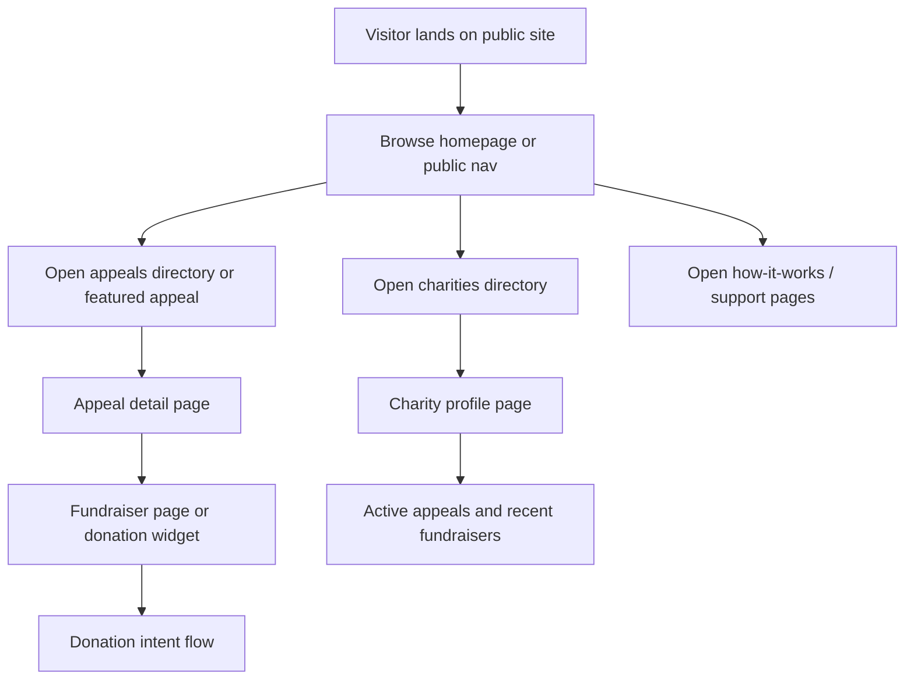

### Donation flow

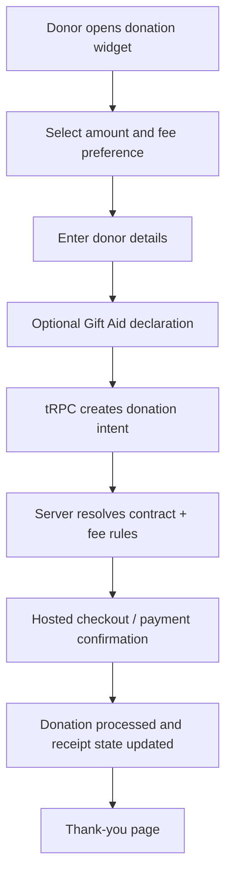

### Public fundraiser page

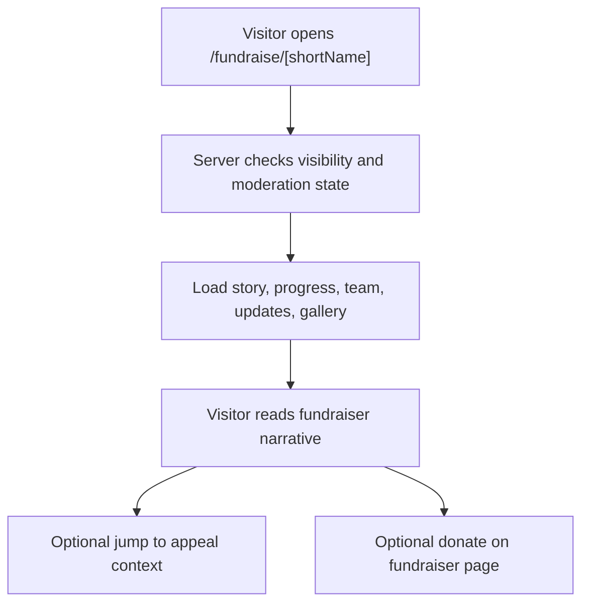

## Fundraiser owner flows

### Create a fundraiser page

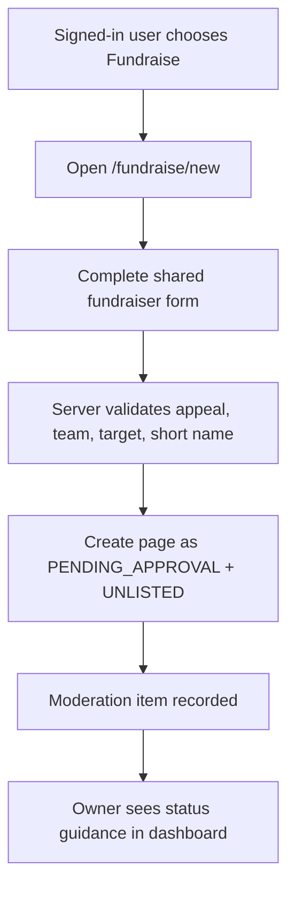

### Manage an existing fundraiser page

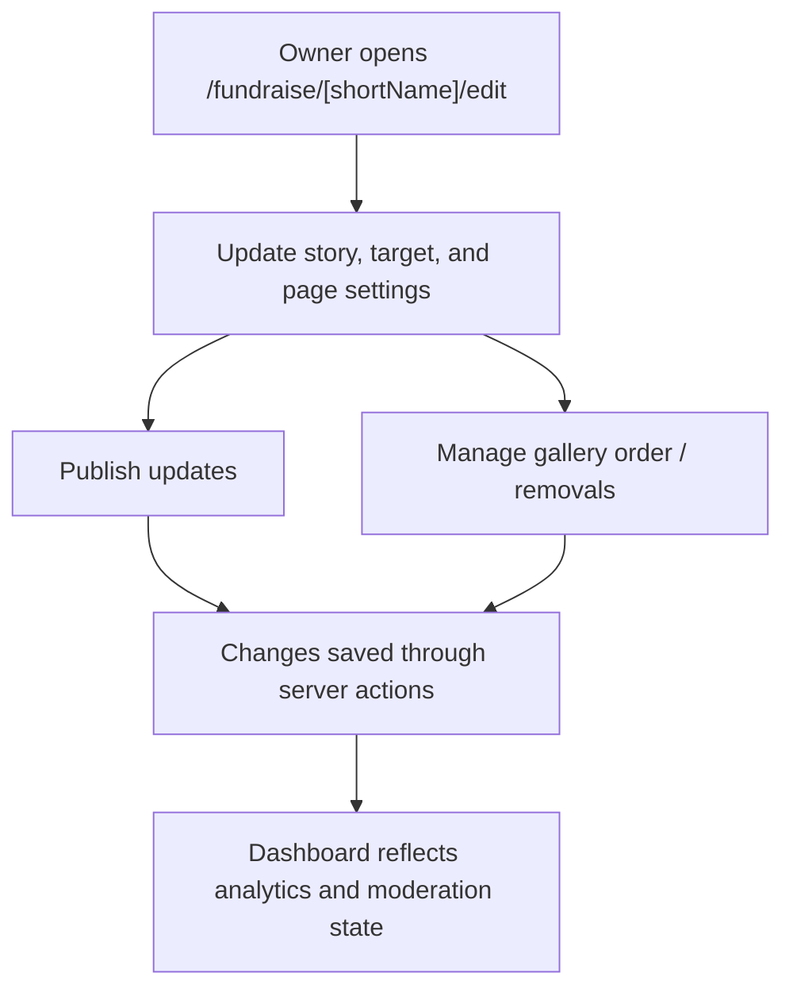

### Auth and dashboard journey

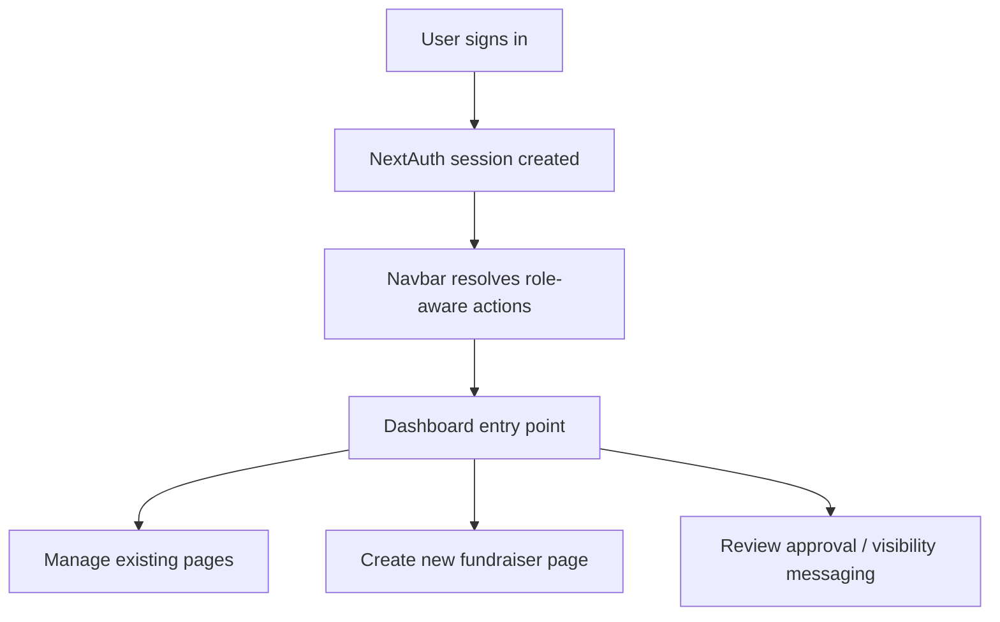

## Charity admin flows

### Charity and appeal management

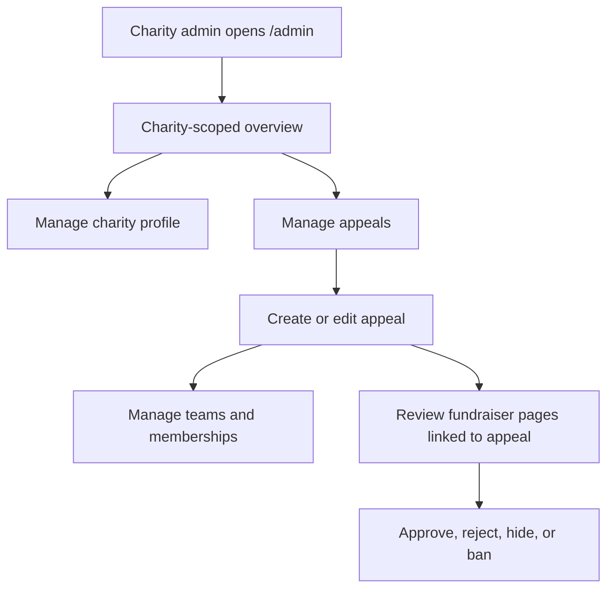

### Offline donations and reports

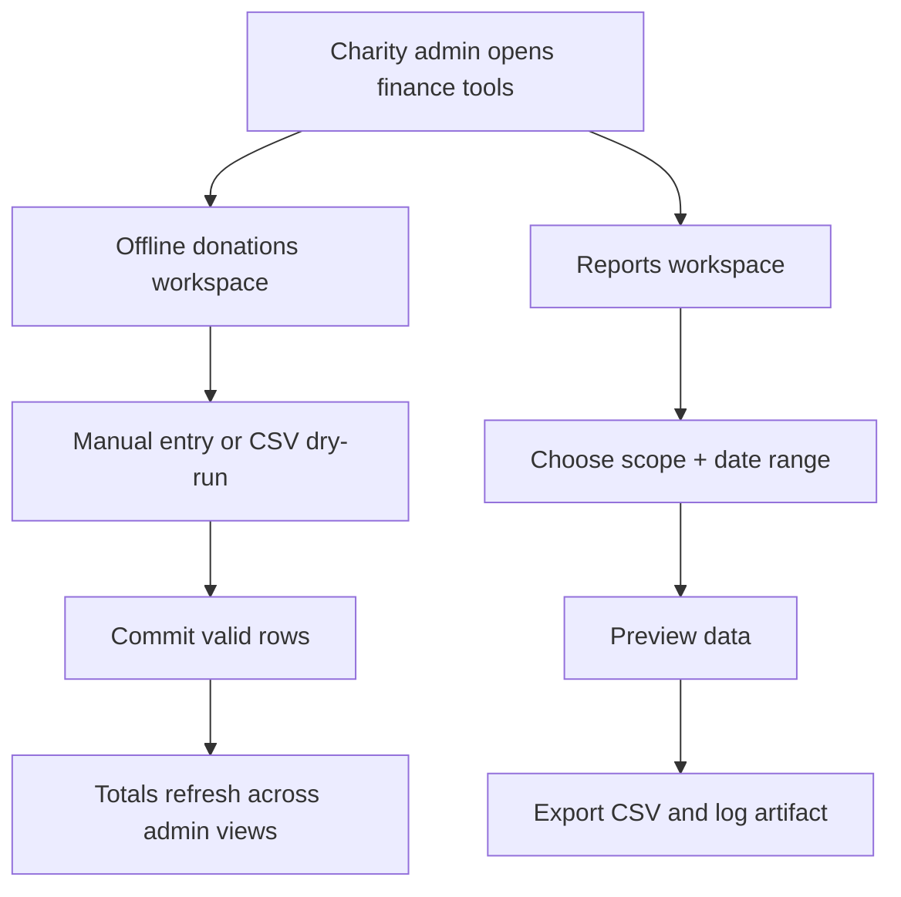

## Platform admin flows

### Platform oversight and user administration

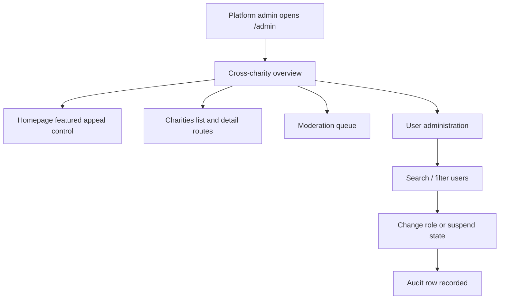

### Analytics and leaderboard oversight

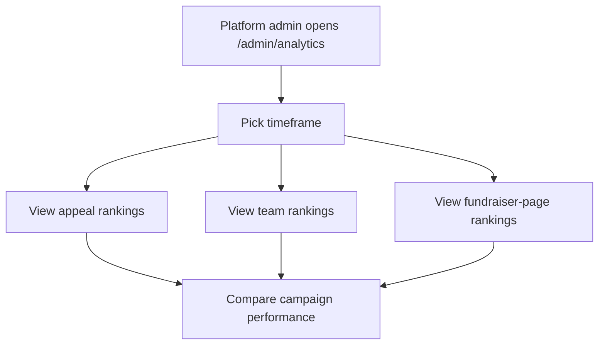

## Finance and operations admin flows

### Donations, refunds, and disputes

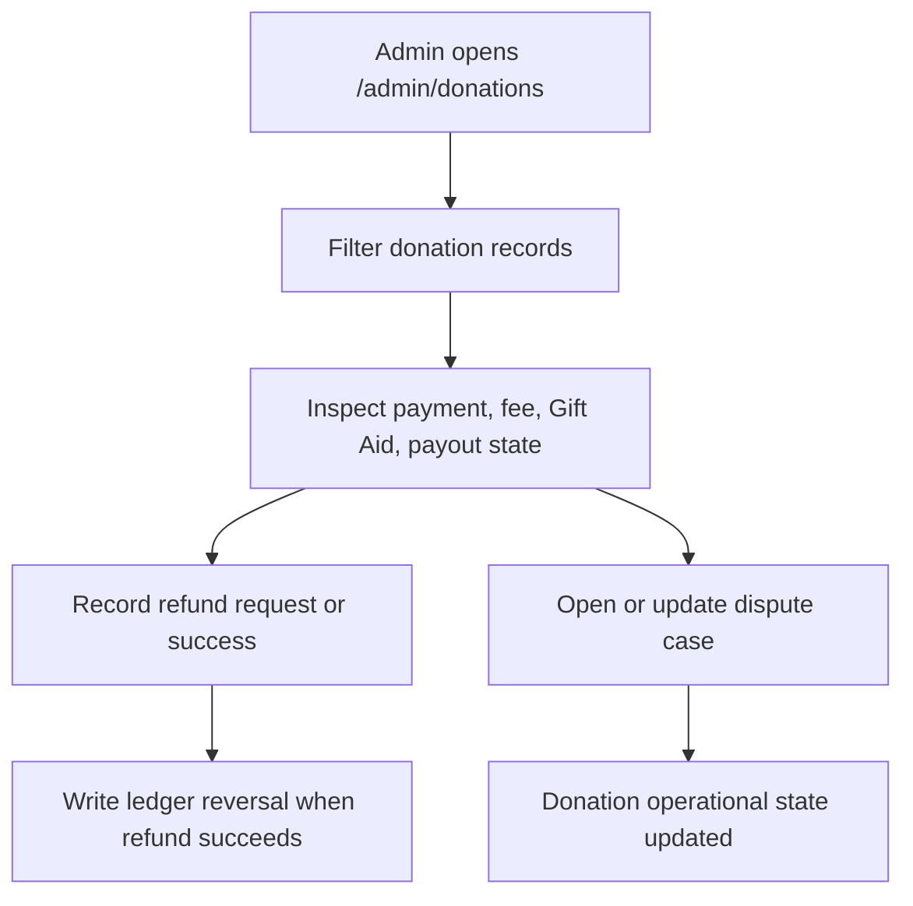

### Gift Aid, payouts, and reconciliation

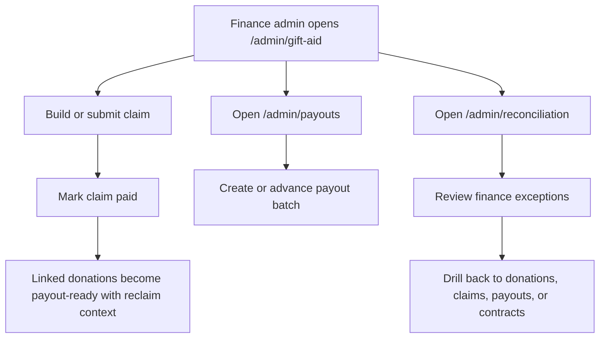

## Area separation

### Public and user-owned surfaces

- Public marketing and donor routes: `/`, `/appeals/[slug]`, `/appeals/[slug]/leaderboard`, `/charities`, `/charities/[slug]`, `/how-it-works`, `/zakat-gift-aid`
- Auth and donor support routes: `/auth/signin`, `/auth/error`, `/checkout/test/[donationId]`, `/donations/thank-you/[donationId]`
- Fundraiser owner routes: `/fundraise/new`, `/fundraise/[shortName]`, `/fundraise/[shortName]/edit`

### Admin-only surfaces

- Core admin: `/admin`, `/admin/charities`, `/admin/appeals`, `/admin/moderation`, `/admin/users`
- Finance and operations: `/admin/donations`, `/admin/disputes`, `/admin/offline`, `/admin/gift-aid`, `/admin/payouts`, `/admin/reports`, `/admin/reconciliation`
- Analytics and settings: `/admin/analytics`, `/admin/settings`

## When to update this file

- Add or revise a diagram when a new route family, role boundary, or approval step is introduced
- Keep route names aligned with the current product surface
- Update role separation if admin permissions or self-serve fundraiser capabilities expand
